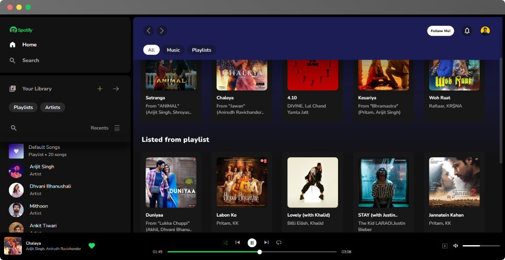

<!-- PROJECT LOGO -->
 

  

  <h3 align="center">Spotify Clone-by Raghvendra Misra</h3>

 

    Best one you'll ever find!
     
    <a href="https://spotifyclonebyrv.freewebhostmost.com"><strong>Veiw Live Project»</strong></a>
     
     
    <a href="linkedin.com/in/raghvendra-misra-424803262">linkedIn</a>
    ·
    <a href="https://twitter.com/raghvendra_001">Twitter</a>
    ·
    <a href="https://instagram.com/xeno.dz">Instagram</a>
  

 
 

<!-- ABOUT THE PROJECT -->
## About The Project

My project is an improved version of a Spotify clone, with the vision of making it the best of all. It focuses on enhancing the user experience (UX) and ensuring full responsiveness across devices. This clone offers a wide range of features designed to emulate the functionality of Spotify while introducing additional enhancements for a seamless user experience.
 
 

  

  

 
 

## Key Features:

* 🔥 **Real-time Song Updates:** Experience real-time updates for the current song name and card details, providing users with instant access to the latest informationrs.
  
* 🔥 **Responsive Design:** The application is fully responsive, dynamically adjusting to the size of the viewport to ensure optimal viewing and interaction across various devices and screen sizes.
  
* 🔥 **Dynamic Song Card Addition:** Song cards are dynamically added based on the size of the viewport, ensuring that users can easily navigate and discover new music regardless of their device.
  
* 🔥 **Comprehensive Button Functionality:** All essential buttons, including loop, skip, previous, pause, and play, are fully functional, providing users with complete control over their music playback experience.
  
* 🔥 **Progress Bar:** A progress bar displays the current playback position of the song, allowing users to visualize the progress and navigate within the track seamlessly.

* 🔥 **Real-time Duration Updates:** The current duration of the song is continuously updated in real-time, ensuring accurate tracking of the playback progress.

* 🔥 **Volume Control:** A volume bar allows users to adjust the volume level according to their preferences, providing a customizable listening experience.

* 🔥 And much more..

  

## Current progress

Working on **Responsiveness**, thus its best suited for bigger screens currently!

<h3>Planned Backend Integration:</h3>
The application is planned to integrate with a typical backend soon, enabling features such as user authentication, playlist management, and personalized recommendations based on user preferences and listening history.

With the vision of making it the best of all, my Spotify clone aims to offer a comprehensive music streaming experience with enhanced features and improved usability, catering to the needs of modern music enthusiasts.

  
## Contact

Your Name - [@raghvendra_001](https://twitter.com/raghvendra_001) - itsraghav12@gmail.com

Project Link: [https://github.com/dev-raghvendramisra/Spotify-CLone](https://github.com/dev-raghvendramisra/Spotify-Clone)

