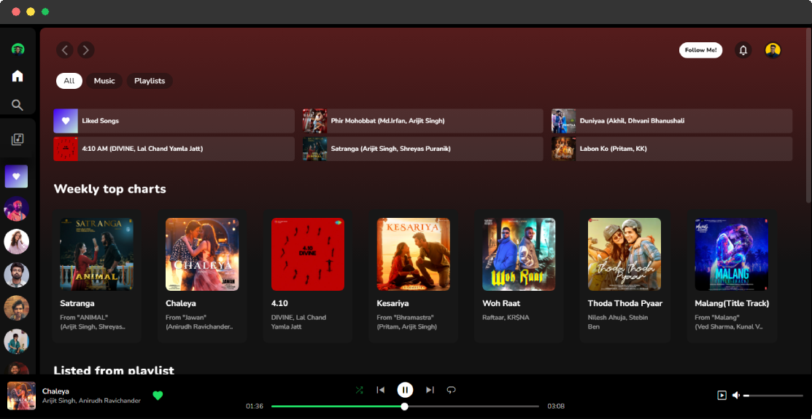
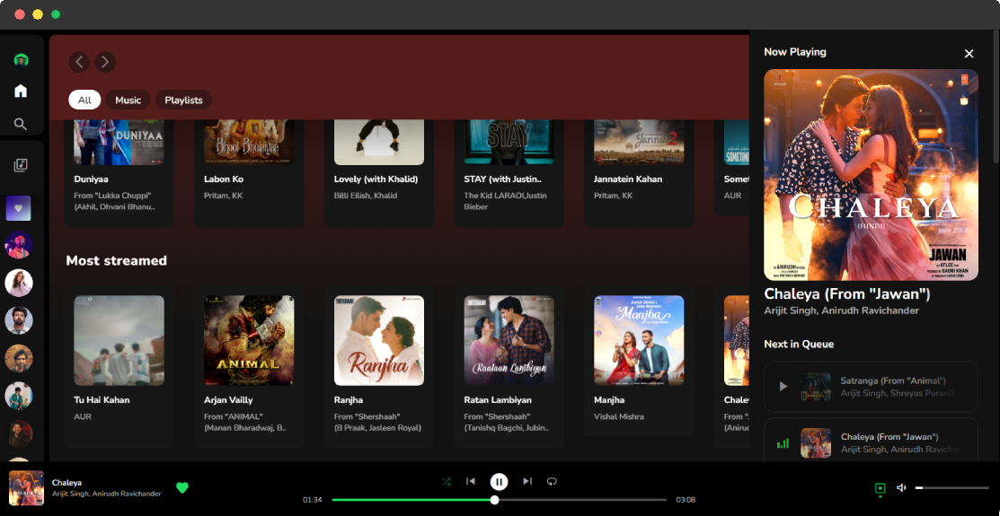

<!-- PROJECT LOGO -->
 

 

     
    <a href="https://spotifyclonebyrv.vercel.app"><strong>Veiw Live Project»</strong></a>
     
     
    <a href="linkedin.com/in/raghvendra-misra-424803262">linkedIn</a>
    ·
    <a href="https://twitter.com/raghvendra_001">Twitter</a>
    ·
    <a href="https://instagram.com/xeno.dz">Instagram</a>
  

 
 

<!-- ABOUT THE PROJECT -->
## About The Project

My project is an improved version of a Spotify clone, with the vision of making it the best of all. It focuses on enhancing the user experience (UX) and ensuring full responsiveness across devices. This clone offers a wide range of features designed to emulate the functionality of Spotify while introducing additional enhancements for a seamless user experience.
 
 

  

 
 

## Key Features:

* 🔥 **Real-time Song Updates:** Instantly access the latest song information with real-time updates for song names and card details, ensuring a seamless listening experience.
  
* 🔥 **Responsive Design:** Adapt fluidly to various viewport sizes, guaranteeing optimal interaction across all devices and screen dimensions.
  
* 🔥 **Dynamic Song Card Addition:** Generate song cards dynamically based on viewport size, enabling effortless navigation and discovery of new music.
  
* 🔥 **Comprehensive Button Functionality:** All essential buttons, including loop, skip, previous, pause, and play, are fully functional, providing users with complete control over their music playback experience.
  
* 🔥 **Progress Bar:** Enjoy complete control over music playback with fully functional buttons for loop, skip, previous, pause, and play functions.

* 🔥 **Real-time Duration Updates:** Stay informed about current song duration with continuous real-time updates, ensuring accurate tracking of playback progress.

* 🔥 **Volume Control:** Customize listening experience with a volume bar, allowing precise adjustment of audio levels to suit individual preferences.
  
* 🔥 **Automated Content Management:** Effortlessly update song arrays, with changes instantly reflected across the application, ensuring availability of new music everywhere.
  
* 🔥 And much more..

  

## Current progress

Working on **Backend Integration** to make it end to end functional !

Version: <code>1.1.0</code>
  

## Why Vanilla JavaScript?

The choice of vanilla JavaScript was deliberate, aimed at strengthening core programming concepts. By eschewing the abstractions of frameworks, developers delve deep into the fundamentals, honing their understanding of JavaScript's underlying principles. This approach not only fosters a more profound comprehension of the language but also equips developers with the versatility to adapt to different frameworks and technologies as needed.

## Leveraging Core Concepts in Frameworks:

Frameworks like React build upon these core JavaScript concepts, abstracting repetitive tasks and providing efficient solutions to common development challenges. By understanding the intricacies of vanilla JavaScript, developers can leverage React's component-based architecture, virtual DOM, and state management capabilities to streamline development workflows and create robust, maintainable applications. React's philosophy of "learn once, write anywhere" underscores the importance of mastering foundational JavaScript concepts, empowering developers to tackle complex projects with confidence.

## Contributions and Technologies:

The project meticulously addresses every minor detail, ensuring a polished user experience. Core JavaScript concepts, including integration of the Media Session API, History API, keyboard responses, and search functionality, have been meticulously implemented.

With the vision of making it the best of all, my Spotify clone aims to offer a comprehensive music streaming experience with enhanced features and improved usability, catering to the needs of modern music enthusiasts.

  
## Contact

Raghvendra Misra - [@raghvendra_001](https://twitter.com/raghvendra_001) - itsraghav12@gmail.com

