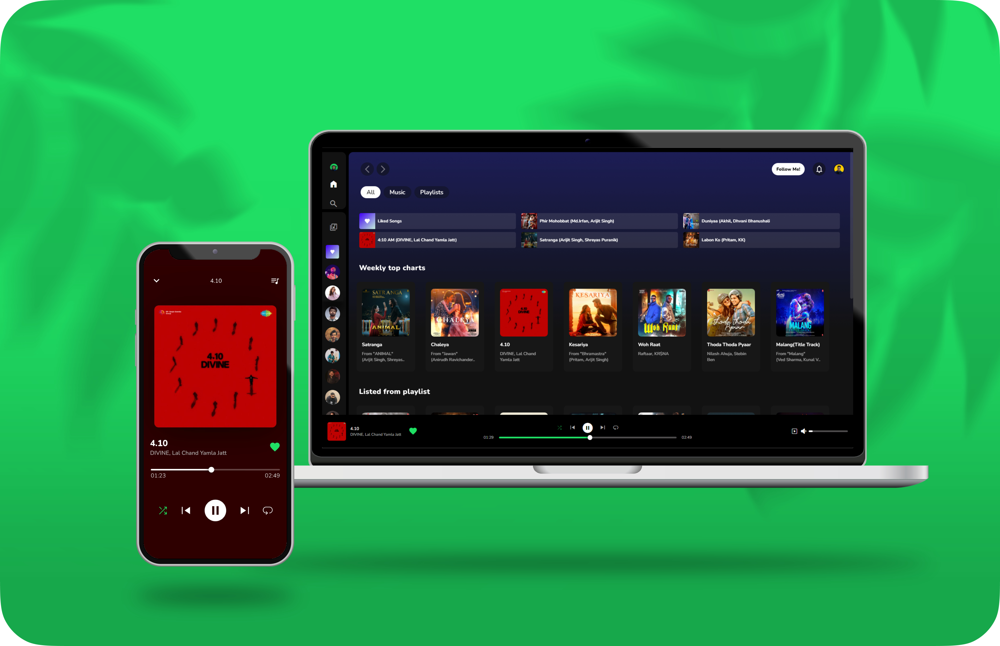
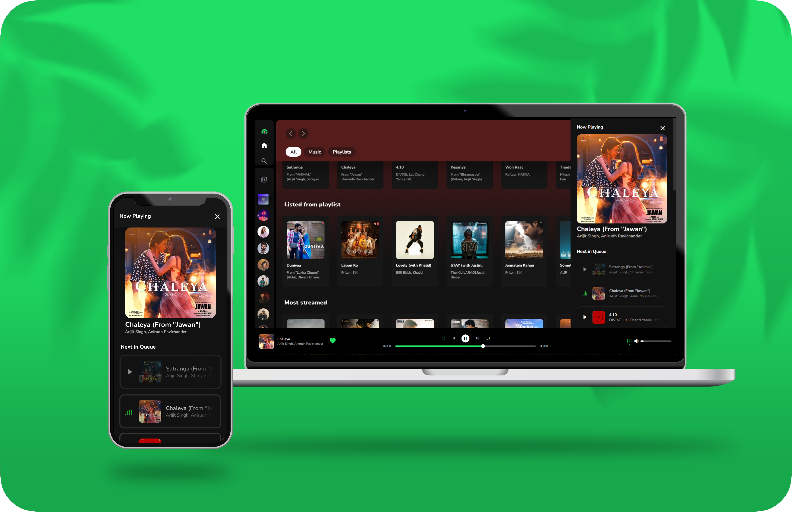

<!-- PROJECT LOGO -->
 

  

     
    <a href="https://spotifyclonebyrv.vercel.app"><strong>View Live Project »</strong></a>
      
    <a href="https://www.linkedin.com/in/raghvendra-misra-424803262">LinkedIn</a> ·
    <a href="https://twitter.com/raghvendra_001">Twitter</a> ·
    <a href="https://instagram.com/xeno.dz">Instagram</a>
  

---

## 📌 About The Project

My project is an improved version of a **Spotify clone**, focusing on enhancing **user experience (UX)** and **full responsiveness** across devices. This clone emulates Spotify’s functionality while introducing **extra enhancements** for a seamless experience.

### Screenshots:

---

## 🚀 Key Features:

- 🔥 **Real-time Song Updates** → Instantly updates song details, ensuring a seamless experience.
- 🔥 **Responsive Design** → Adapts to various screen sizes for a consistent UI.
- 🔥 **Dynamic Song Cards** → Generates song cards based on viewport size.
- 🔥 **Full Playback Controls** → Includes loop, skip, previous, pause, and play buttons.
- 🔥 **Progress Bar** → Shows real-time song progress.
- 🔥 **Volume Control** → Allows precise audio adjustments.
- 🔥 **Real-time Duration Updates** → Displays accurate playback progress.
- 🔥 **Automated Content Management** → Instantly updates song arrays throughout the app.

---

## Current Progress

Currently working on **Backend Integration** to make the app fully functional! 🎯 

**Version:** `1.1.0`

---

## 🤔 Why Vanilla JavaScript?

Choosing **vanilla JavaScript** helps in mastering core programming concepts before using frameworks. Without relying on abstractions, developers gain **a deep understanding** of JavaScript’s principles, making it easier to adopt frameworks like React later.

### 📌 How It Helps in Frameworks

- **React & Other Frameworks** build on core JavaScript concepts.
- **Understanding the fundamentals** helps in using the Virtual DOM, state management, and component-based architectures effectively.
- **"Learn once, write anywhere"** → Mastering JavaScript first makes using any framework easier.

---

## 🏗 Contributions and Technologies

This project meticulously implements **core JavaScript concepts**, including:
- **Media Session API** → Enhanced media control.
- **History API** → Better navigation and state management.
- **Keyboard Shortcuts** → Added keyboard response support.
- **Search Functionality** → Quick access to favorite songs.

With these refinements, my **Spotify clone** offers a **comprehensive and enhanced** music streaming experience for modern users.

---

## 📞 Contact

**Raghvendra Misra**  
- Twitter: [@raghvendra_001](https://twitter.com/raghvendra_001)  
- Email: itsraghav12@gmail.com  
